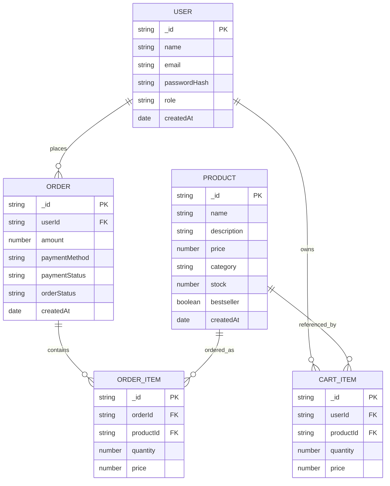

# ER Diagram

```mermaid
erDiagram
    USER ||--o{ ORDER : places
    USER ||--o{ CART_ITEM : owns
    PRODUCT ||--o{ CART_ITEM : referenced_by
    ORDER ||--o{ ORDER_ITEM : contains
    PRODUCT ||--o{ ORDER_ITEM : ordered_as

    USER {
        string _id PK
        string name
        string email
        string passwordHash
        string role
        date createdAt
    }

    PRODUCT {
        string _id PK
        string name
        string description
        number price
        string category
        number stock
        boolean bestseller
        date createdAt
    }

    CART_ITEM {
        string _id PK
        string userId FK
        string productId FK
        number quantity
        number price
    }

    ORDER {
        string _id PK
        string userId FK
        number amount
        string paymentMethod
        string paymentStatus
        string orderStatus
        date createdAt
    }

    ORDER_ITEM {
        string _id PK
        string orderId FK
        string productId FK
        number quantity
        number price
    }
```
