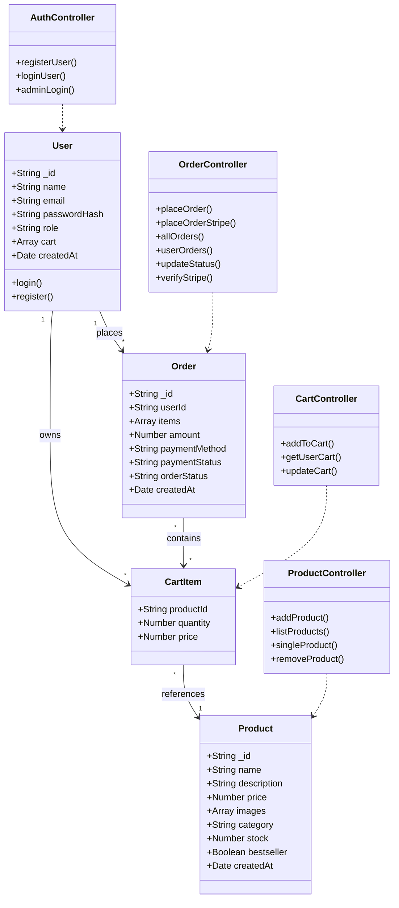

# Class Diagram

```mermaid
classDiagram
    class User {
      +String _id
      +String name
      +String email
      +String passwordHash
      +String role
      +Array cart
      +Date createdAt
      +login()
      +register()
    }

    class Product {
      +String _id
      +String name
      +String description
      +Number price
      +Array images
      +String category
      +Number stock
      +Boolean bestseller
      +Date createdAt
    }

    class Order {
      +String _id
      +String userId
      +Array items
      +Number amount
      +String paymentMethod
      +String paymentStatus
      +String orderStatus
      +Date createdAt
    }

    class CartItem {
      +String productId
      +Number quantity
      +Number price
    }

    class AuthController {
      +registerUser()
      +loginUser()
      +adminLogin()
    }

    class ProductController {
      +addProduct()
      +listProducts()
      +singleProduct()
      +removeProduct()
    }

    class OrderController {
      +placeOrder()
      +placeOrderStripe()
      +allOrders()
      +userOrders()
      +updateStatus()
      +verifyStripe()
    }

    class CartController {
      +addToCart()
      +getUserCart()
      +updateCart()
    }

    User "1" --> "*" Order : places
    User "1" --> "*" CartItem : owns
    CartItem "*" --> "1" Product : references
    Order "*" --> "*" CartItem : contains

    AuthController ..> User
    ProductController ..> Product
    OrderController ..> Order
    CartController ..> CartItem
```
