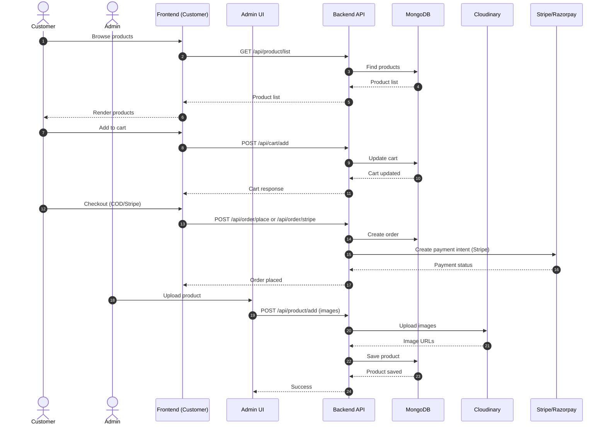

# Sequence Diagram

```mermaid
sequenceDiagram
    autonumber
    actor Customer
    actor Admin
    participant FE as Frontend (Customer)
    participant ADM as Admin UI
    participant API as Backend API
    participant DB as MongoDB
    participant Cloud as Cloudinary
    participant Stripe as Stripe/Razorpay

    Customer->>FE: Browse products
    FE->>API: GET /api/product/list
    API->>DB: Find products
    DB-->>API: Product list
    API-->>FE: Product list
    FE-->>Customer: Render products

    Customer->>FE: Add to cart
    FE->>API: POST /api/cart/add
    API->>DB: Update cart
    DB-->>API: Cart updated
    API-->>FE: Cart response

    Customer->>FE: Checkout (COD/Stripe)
    FE->>API: POST /api/order/place or /api/order/stripe
    API->>DB: Create order
    API->>Stripe: Create payment intent (Stripe)
    Stripe-->>API: Payment status
    API-->>FE: Order placed

    Admin->>ADM: Upload product
    ADM->>API: POST /api/product/add (images)
    API->>Cloud: Upload images
    Cloud-->>API: Image URLs
    API->>DB: Save product
    DB-->>API: Product saved
    API-->>ADM: Success
```
